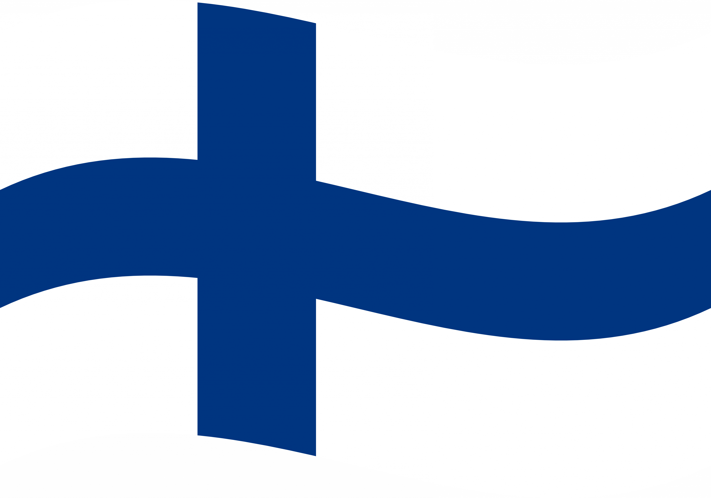
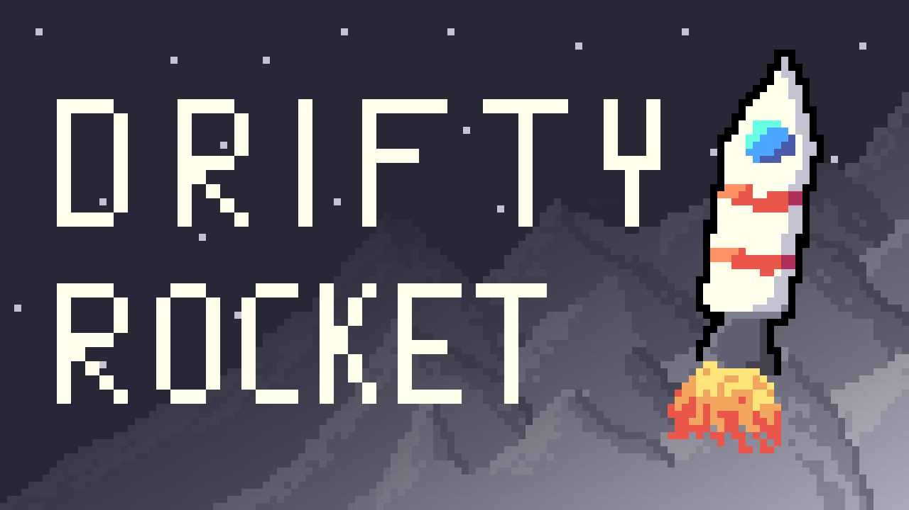
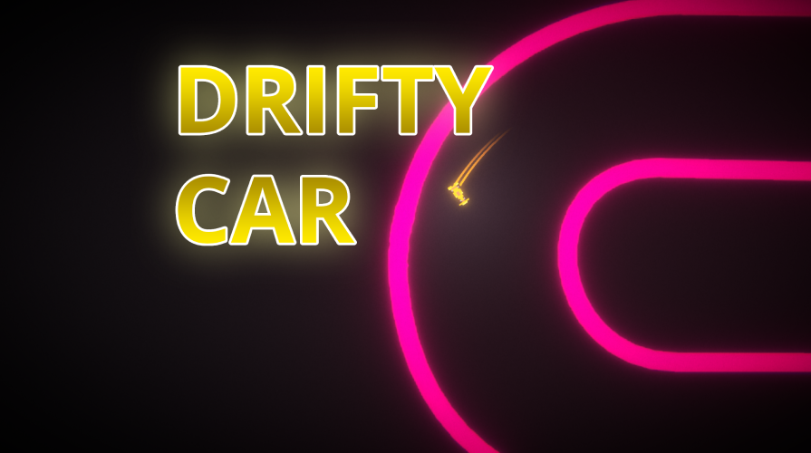
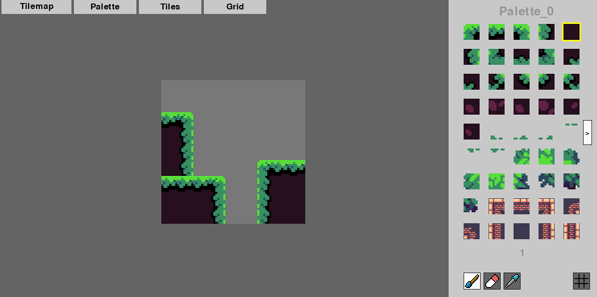
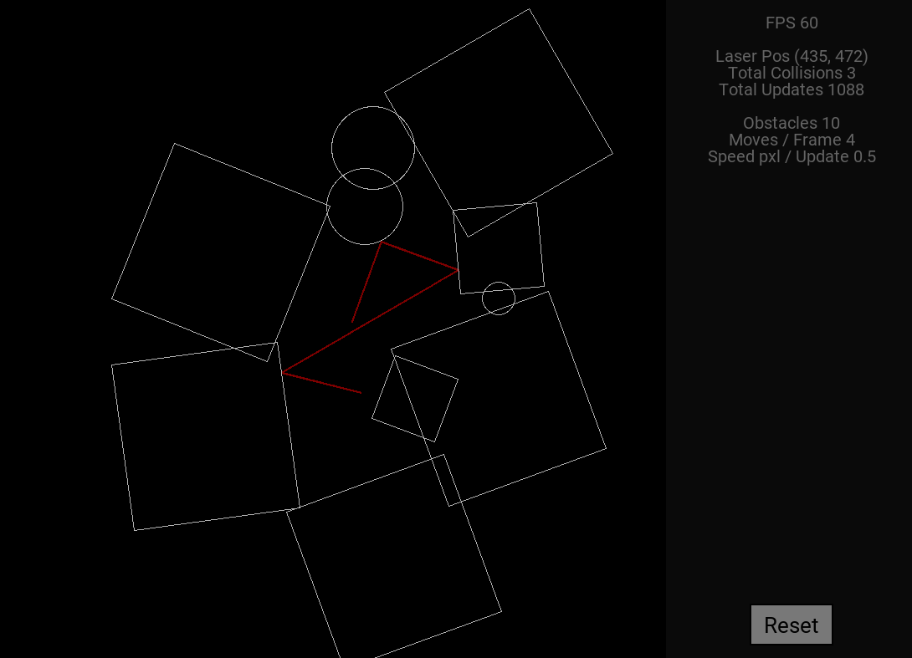
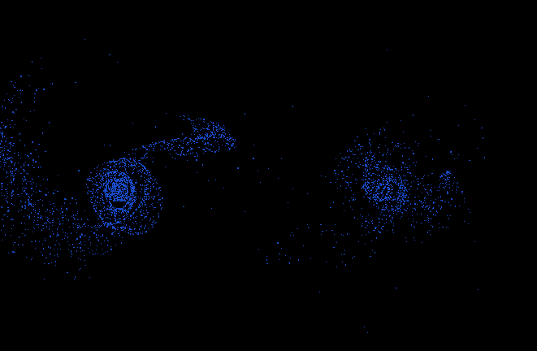

# Hello👋 good to see you!  

Welcome to my Profile!  
I'm <b>Roman</b>, a 16 year-old programmer from  <b>Helsinki, Finland</b>.  

## What I code with?

  

  

## My Projects

### Unity and C# Projects

<table>
  <tr>
    <th>  </th> 
    <th> <a href="https://omppu42.itch.io/drifty-rocket"> <b> Drifty Rocket</b></a> was my first game that I published.   You control a rocket that needs to fight the gravity and reach the finish.   The faster you finish, the better. You can collect stars, which are progressively more difficult.   </th>
  </tr>
  <tr>
    <th>    </th>
    <th> <a href="https://omppu42.itch.io/drifty-car"><b> Drifty Car</b></a> was made in 1 week for <i> Brackeys Game Jam 2023.1</i>.  
In the game, you drift around the corners beating opponent after another,  while trying to set a new personal best each time!  </th>
  </tr>
</table>

----

### Python and Pygame projects

<table>
  <tr>
    <th>    </a> </th> 
    <th> <a href="https://github.com/Omppu42/TilemapEditor"> <b> Tilemap Editor</b></a> was my first real project.   I finished it after 2 months of intence developing.   It's an utility tool for creating tilemaps, that has all sorts of interesting features. </th>
  </tr>
  <tr>
    <th>    </th>
    <th> <a href="https://github.com/Omppu42/LaserSimulation"><b> Lazer Simulation</b></a> is my latest project.  This time I wanted to focus on developing a   friendly user interface,  so that users could play around more freely and easily.   I can confidently say that I accomplished that goal.</th>
  </tr>
</table>

----

### C++ projects
<table>
  <tr>
    <th>    </a> </th> 
    <th> <a href="https://github.com/Omppu42/ParticleSimulation"> <b> Particle Simulation</b></a> is a pretty recent project.   This was my first ever C++ program, so it took quite a while.   It has the capacity to simulate nearly 10000 particles.   I used C++ and OpenGL for this.  </th>
  </tr>
</table>

## Contact me

Feel free to email me: ***REMOVED***
